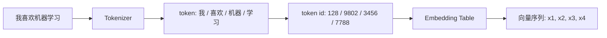

# 01 Token 与 Embedding

LLM 不能直接处理字符串。它首先把文本切成 token，再把 token 映射成向量。

## 本章要点

- Token 是模型处理文本的基本单位。
- Tokenizer 把文本转成 token id。
- Embedding 把 token id 转成向量。
- Transformer 后续所有计算都发生在向量空间中。

## 从文本到 token

示例：

```text
文本：我喜欢机器学习
```

Tokenizer 可能切成：

```text
["我", "喜欢", "机器", "学习"]
```

也可能切成：

```text
["我", "喜", "欢", "机器学习"]
```

不同模型使用不同 tokenizer，所以同一句话在不同模型里的 token 数可能不同。

## 流程图



## Embedding 是什么

Embedding 可以理解为一张大表：

| token id | 向量 |
| --- | --- |
| 128 | `[0.12, -0.03, 0.88, ...]` |
| 9802 | `[-0.45, 0.21, 0.09, ...]` |
| 3456 | `[0.04, 0.66, -0.31, ...]` |

模型训练时会不断调整这张表，让语义或用法相近的 token 在向量空间中更容易被后续层利用。

## 具体例子

假设词表只有 5 个 token：

```text
0: <pad>
1: 我
2: 喜欢
3: 机器
4: 学习
```

输入：

```text
我 喜欢 机器 学习
```

变成：

```text
[1, 2, 3, 4]
```

再通过 embedding 表变成：

```text
[
  [0.10, 0.30, -0.20],
  [0.50, -0.10, 0.40],
  [-0.20, 0.80, 0.10],
  [0.00, 0.60, 0.70]
]
```

这就是 Transformer 真正看到的输入。

## Token 数为什么重要

API 计费、上下文窗口和延迟通常都和 token 数有关。

```text
更长输入 → 更多 token → 更高成本 → 更长延迟
```

这也是为什么 RAG 不能把整个知识库都塞进 prompt，而要先检索再精选上下文。

## 常见误解

**误解：一个汉字就是一个 token。**

不一定。tokenizer 可能把常见词合并，也可能把生僻词拆开。

**误解：Embedding 就是最终语义。**

不是。Embedding 只是初始向量。经过多层 Transformer 后，每个 token 的向量会融合上下文，变成上下文化表示。

## 练习

估算下面三类输入中，哪类 token 数最多：

1. 一段 200 字中文产品说明。
2. 一段 200 个英文单词的说明。
3. 一段包含 JSON、代码、URL 的接口日志。

思考：为什么代码和 JSON 往往很耗 token？
