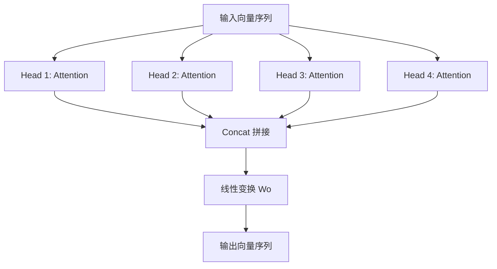
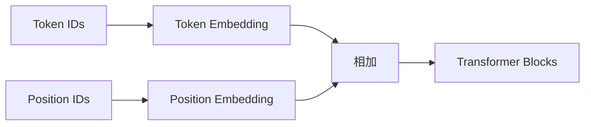
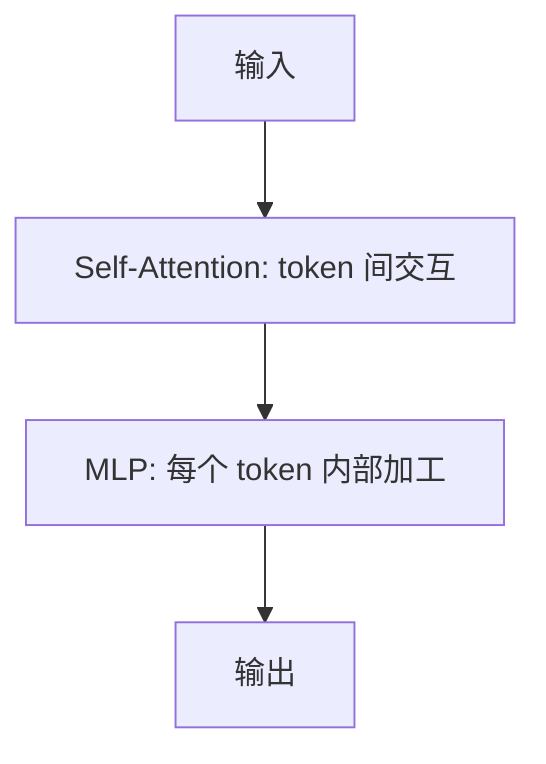

# 03 Multi-Head Attention 与位置编码

单个 Attention 头只能从一个表示空间观察 token 关系。Multi-Head Attention 让模型从多个角度同时观察上下文。

## 本章要点

- Multi-Head Attention = 多组 Q/K/V 并行计算。
- 不同 head 可以学习不同关系，例如语法、指代、位置、实体关联。
- Transformer 本身不天然知道 token 顺序，需要位置编码。
- 残差连接和 LayerNorm 让深层网络更稳定。

## Multi-Head Attention 原理图



直觉：

```text
Head 1：关注主语和谓语
Head 2：关注代词指代
Head 3：关注相邻词
Head 4：关注实体和属性
```

真实模型不会显式标注每个 head 的职责，但训练后可能形成类似分工。

## 位置编码为什么必要

Self-Attention 本身看的是 token 集合之间的关系。如果没有位置信息，模型很难区分：

```text
狗 咬 人
人 咬 狗
```

这两个句子 token 相同，但顺序不同，意思完全不同。

所以输入 Transformer 前，需要加入位置信息：

```text
token_embedding + position_embedding
```

流程：



## 常见位置编码

| 方法 | 思路 |
| --- | --- |
| 绝对位置编码 | 第 1、2、3... 个位置各有一个向量 |
| 正弦位置编码 | 用 sin/cos 函数生成位置向量 |
| RoPE | 旋转位置编码，现代 LLM 常见 |
| ALiBi | 用距离偏置影响注意力分数 |

你不需要一开始掌握所有数学细节，但要知道：**位置编码决定模型如何感知顺序和距离**。

## 残差连接

Transformer Block 中常见结构：

```text
x = x + attention(layer_norm(x))
x = x + mlp(layer_norm(x))
```

残差连接的作用：

- 让原始信息可以直接传到后面层。
- 缓解深层网络训练困难。
- 允许每层在原表示上做“增量修改”。

## MLP 层做什么

Attention 负责 token 之间的信息交互。
MLP 负责对每个 token 的表示做非线性变换。

可以粗略理解为：

```text
Attention：从上下文收集信息
MLP：对收集到的信息进行加工
```

一个 Block：



## 具体示例

句子：

```text
小明 在 北京 工作
```

不同 head 可能学习：

| Head | 可能关注 |
| --- | --- |
| Head 1 | “小明” 和 “工作” 的主谓关系 |
| Head 2 | “北京” 和 “工作” 的地点关系 |
| Head 3 | 相邻 token 的局部组合 |

经过多层堆叠后，“工作”这个 token 的向量会融合：

- 谁工作
- 在哪里工作
- 当前句子的语法结构
- 前文上下文中的相关信息

## 常见误解

**误解：head 越多越好。**

不一定。head 数量、隐藏维度、层数、训练数据和算力需要整体设计。

**误解：位置编码只是编号。**

位置编码不仅告诉模型“第几个 token”，还影响模型理解距离、顺序和长上下文。

## 练习

比较下面两句话：

```text
用户 删除 了 文件
文件 删除 了 用户
```

如果没有位置编码，模型为什么难以区分它们？
