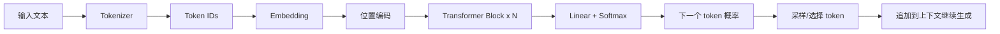
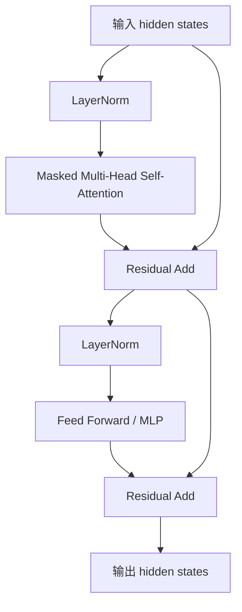

# Transformer 原理教程

Transformer 是现代大语言模型的核心架构。ChatGPT、Claude、Kimi、DeepSeek、通义千问等主流 LLM，
底层都可以理解为 Transformer 的不同规模、训练数据、训练方法和工程优化版本。

本模块不要求你手写一个可训练的大模型，但要求你理解：

- 为什么 LLM 能根据上下文预测下一个 token。
- Self-Attention 如何让每个 token “看见”其它 token。
- Q、K、V 分别是什么。
- Multi-Head Attention 为什么有用。
- 位置编码为什么必要。
- Decoder-only Transformer 如何一边读上下文一边生成文本。

## 学习位置

建议在 [llm_api](../05_llm_api/) 之前学习本模块：

```text
basic → protocols → transformer → llm_api → prompt → rag
```

如果你只想快速调用 API，可以先跳过本模块；但如果想理解上下文窗口、token、注意力、幻觉、长文本成本和模型生成机制，这一章非常重要。

## Transformer 解决了什么问题

语言模型的任务可以简化为：

```text
给定前面的 token，预测下一个 token。
```

例如：

```text
输入：今天 天气 很
预测：好
```

真正困难的地方是：模型要根据上下文判断哪些词重要。

```text
小明把书放进书包，因为他要去学校。它很重。
```

这里的“它”更可能指“书包”，不是“学校”。模型需要在句子内部建立 token 之间的关系。
Transformer 的核心能力就是：**让每个 token 动态关注上下文中与自己相关的 token**。

## 总体结构图

经典 Transformer 论文中包含 Encoder 和 Decoder 两部分。现代大语言模型主要使用 Decoder-only 结构。



一个 Decoder-only Transformer Block 通常长这样：



## 章节目录

1. [01_tokens_embeddings](./01_tokens_embeddings/)：Token、Embedding 与语言模型输入
2. [02_self_attention](./02_self_attention/)：Self-Attention、Q/K/V 与注意力分数
3. [03_multi_head_position](./03_multi_head_position/)：Multi-Head Attention、位置编码与残差连接
4. [04_decoder_generation](./04_decoder_generation/)：Decoder-only Transformer 与自回归生成
5. [05_limitations](./05_limitations/)：上下文窗口、幻觉、计算成本与工程启发
6. [06_llm_concepts](./06_llm_concepts/)：从 Transformer 到 LLM API 的关键概念过渡

## 核心公式速览

Self-Attention 的核心公式：

```text
Attention(Q, K, V) = softmax(QK^T / sqrt(d_k)) V
```

含义：

- `Q`：Query，当前 token 想找什么信息。
- `K`：Key，其它 token 提供什么索引。
- `V`：Value，其它 token 真正贡献的内容。
- `QK^T`：计算 token 之间的相关性。
- `softmax`：把相关性变成权重。
- `softmax(...)V`：按权重加权汇总信息。

## 一个直观例子

句子：

```text
猫 坐 在 垫子 上
```

当模型处理“坐”这个 token 时，它可能更关注：

```text
猫：谁在坐？
垫子：坐在哪里？
```

注意力权重可以想象成：

| 当前 token | 关注 token | 权重 |
| --- | --- | --- |
| 坐 | 猫 | 0.45 |
| 坐 | 垫子 | 0.35 |
| 坐 | 在 | 0.10 |
| 坐 | 上 | 0.10 |

真实模型不是用人工规则设置权重，而是在训练中学会这些模式。

## 与 AI 应用开发的关系

理解 Transformer 能帮助你解释很多工程现象：

| 现象 | Transformer 视角 |
| --- | --- |
| 上下文越长越贵 | Attention 需要在 token 间计算关系，长上下文计算和显存成本高 |
| 模型没有真实记忆 | 每次请求只处理当前上下文里的 token |
| Prompt 顺序会影响结果 | token 之间通过注意力交互，位置和上下文都会影响 hidden states |
| RAG 需要控制上下文质量 | 检索内容会进入上下文，直接影响注意力和生成 |
| 幻觉无法完全消除 | 模型本质是概率生成，不是数据库查询 |
| 流式输出可以逐 token 返回 | Decoder-only 模型按自回归方式逐步预测下一个 token |

## 参考

- Vaswani et al., Attention Is All You Need, 2017
- The Illustrated Transformer: https://jalammar.github.io/illustrated-transformer/
- The Annotated Transformer: https://nlp.seas.harvard.edu/annotated-transformer/
