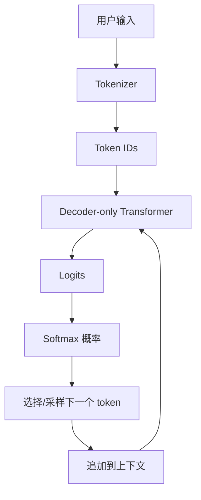

# 04 Decoder-only 与文本生成

现代聊天模型大多是 Decoder-only Transformer。它的核心生成方式是自回归：每次预测下一个 token，再把新 token 接回上下文继续预测。

## 本章要点

- Decoder-only 模型只使用带 causal mask 的 Transformer。
- 生成文本 = 不断预测下一个 token。
- Softmax 输出的是整个词表上的概率分布。
- temperature、top_p 等参数会影响采样行为。

## 生成流程图



## 自回归生成示例

输入：

```text
今天 天气
```

第 1 步：

```text
上下文：今天 天气
预测：很
```

第 2 步：

```text
上下文：今天 天气 很
预测：好
```

第 3 步：

```text
上下文：今天 天气 很 好
预测：。
```

最终：

```text
今天 天气 很 好 。
```

## Logits 和 Softmax

模型最后会为词表中每个 token 输出一个分数，叫 logits。

假设词表只有 5 个 token：

| token | logit |
| --- | --- |
| 好 | 5.2 |
| 差 | 1.1 |
| 热 | 2.4 |
| 冷 | 2.1 |
| 。 | 0.5 |

Softmax 把 logits 转成概率：

| token | 概率 |
| --- | --- |
| 好 | 0.78 |
| 热 | 0.10 |
| 冷 | 0.08 |
| 差 | 0.03 |
| 。 | 0.01 |

模型可以选择最高概率 token，也可以按概率采样。

## temperature 是什么

temperature 控制分布是否更“尖锐”。

| temperature | 效果 | 适合场景 |
| --- | --- | --- |
| 低 | 更稳定、更保守 | 分类、抽取、代码修复 |
| 高 | 更多样、更发散 | 创意写作、头脑风暴 |

直觉：

```text
低温：更倾向选择最高概率 token
高温：低概率 token 也更可能被选中
```

## 为什么聊天模型能遵循指令

预训练阶段，模型主要学习“预测下一个 token”。
但聊天模型还会经过指令微调、偏好优化和安全对齐，让它更倾向于：

- 理解用户指令
- 按格式回答
- 拒绝危险请求
- 多轮对话中保持角色

所以 API 里的 `system`、`user`、`assistant` 消息，最终也会被序列化成模型能处理的 token 序列。

## KV Cache

生成时，如果每一步都重新计算全部上下文，会很慢。

KV Cache 会缓存前面 token 的 Key 和 Value：

```text
第 1 步：计算 token 1..n 的 K/V
第 2 步：只计算新 token 的 K/V，并复用旧缓存
第 3 步：继续复用
```

这就是为什么流式生成可以逐 token 输出，同时保持较高效率。

## 与流式输出的关系

LLM 生成 token 的过程天然适合流式返回：

```text
预测 token 1 → 发送给客户端
预测 token 2 → 发送给客户端
预测 token 3 → 发送给客户端
```

这对应 [llm_api/02_params_streaming](../../llm_api/02_params_streaming/) 中看到的流式输出。

## 常见误解

**误解：模型一次性写完整答案。**

不是。模型逐 token 生成。你看到的完整段落，是很多次下一个 token 预测拼起来的结果。

**误解：最高概率答案一定最好。**

不一定。最高概率可能保守、重复或缺少创造性。不同任务需要不同采样策略。

## 练习

解释为什么：

1. 流式输出能更快让用户看到内容。
2. 很长的上下文会让 first token latency 变高。
3. JSON 输出适合使用较低 temperature。
